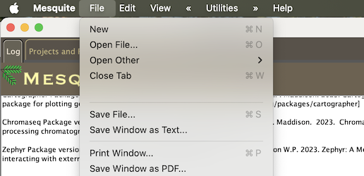
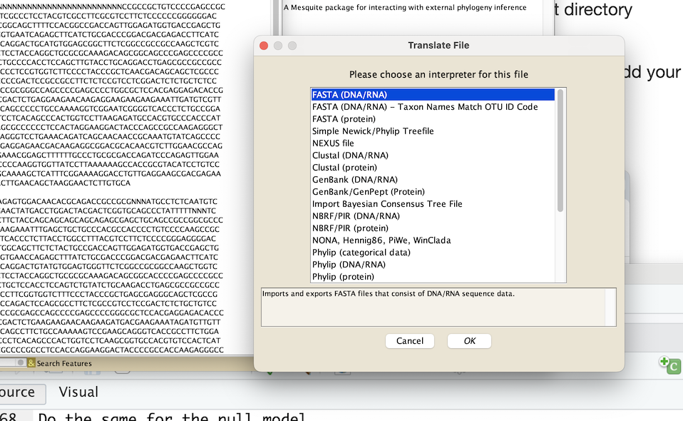

# Session 13: Comparative oncology and life history theory
This README file has instructions to run a test for positive selection on candidate genes for cancer resistant species.

### I. The cluster
1. `ssh <username>@hoffman2.ucla.edu`

* If you are asked to trust this connection type **yes**

2. Then type the password provided by the trainer

### Set the working directory
1. To get a computing node and run your job interactively type the following:   
`qrsh`         
This will give you a cpu with one gigabyte of memory and one hour. This should be enough for today's exercise.  
You should get a success login notification like this:  
**Last login: Fri Jun 27 20:59:39 2025 from 172.16.96.79**    
Notice that you have switched from a login node to a computer node.You should see something like this.   
**[dechavez@n1825 ~]$   
***Note: you may get a different cpu than n1815***

2. Get to the workshop directory.   
Lest check your current directory by typing `pwd`  
**[dechavez@login4 ~]$ /u/home/d/dechavez**         
Now, to get into the workshop directory type the following:   
`cd $SCRATCH/EcoEvoBio-Cancer`   
If you type `pwd` you should be located at:   
**/u/scratch/d/dechavez/EcoEvoBio-Cancer**

3. To create you personal directory, change the following code with your First name and the first to letters of your last name   
`mkdir DanielCH`

4. Navigate into your directory. Note: you should type the name of your directory in the following code
`cd DanielCH`

### II. The alingment and the phylogenetic gene tree 

1. Alignment of the MYC gene.   
`./scripts/muscle3.8.31_i86linux64 -in aligned_MYC.fasta -out aligned_MYC.fasta`
***Note: you wont be able to build a tree unless you aligned it first***

2. Build maximum likelihood phylogeny.  
* Before building the mammal phylogeny tree you need to load the program.
`module load iqtree/2.2.2.6`      
* Then build the phylogeny       
`iqtree2 -s aligned_MYC.fasta`   

### III. Run the model for positive selection     
1. Make sure that the control files can find the tree and phylogeny.       
`cd modelA`    
* Check your control file for the positive selection model. Follow the instructions from the trainer.      
`nano codeml.ctl` 
* Check your control file for the null model called modelAnull       
`cd ../modelAnull`     
`nano codeml.ctl`

2. To Run the program for positive selection get into your script directory   
`cd ../scripts`   
* To identify your job once is submitted into the ***cluster***, you need to add your initials to the name of your job. So let's replace the job id from ***DCHmodelA*** with your initials. For instance, Charles Darwin should have ***CDAmodelA***    
Add your initials into the script for the positive selection model.    
`nano modelA.sh`   
Now add your initials for the null model scripts.    
`cd ../modelAnull`   
`nano modelAnull.sh` 

* Then submit the job to run PAML for the positive selection model.   
`qsub modelA.sh`   
Do the same for the null model.   
`qsub modelAnull.sh`

* Make sure that your job is running. You can check the status of your job with `myjobs`      

### IV. Understanding the model for positive selection
1. Open another terminal and clone this repository      
`git clone <>`

2. Explore your alignment.   
Open the program mesquite.  
Type OK if the following window appears   

        

    

* Open the file called **MYC.aligned.fasta** and chose DNA   

{width=150px} {width=150px}    

* To specify the open reading frame click on **Matrix** on the top and then chose **Current MAtrix** and then **Show Character List**.  

{width=180px}    

* Then click on the column labaled **codon position** and then chose **set codon position** and **minimize stop codon position** 

{width=180px}     

    

* Go back to the matrix tab and clik on display and chose **color matrix cells** and Color **nucleotide by amino acid**   

{width=180px}     

 

* You should now see that your alignment is color by amino acids. To get a color chart click on the following icon that is on the bottom.  

{width=180px}     

**Do you find any stop codons ?**   

2. Now lets take a look at the lineages that may have experienced an event of positive selection   
* Using the program called ***figtree*** clik on **open** and specify your phylogeny with tags on the branches. This file is called MYC.BL.tree   

{width=180px}     

* You can use the left panel to increase the tick of the lines with **appereance** and font size of the terminal branches with **Tip display**.

{width=150px}{width=150px}     

*  Change the color of the branches from black to red for those lineages that have the tag **#1**. You can click on one branch and change its color.   

{width=180px}     

.   
* **What are the common names of the species you label?**    
* **What do they have low cancer prevalence?**    

3. Place the mutation on a protein model.   
Now lets investigate were in the protein is our candidate amino acid change. Click on https://swissmodel.expasy.org/  
* Click on start modeling.  

{width=180px}     

. 
* With your favorite text editor (e.g BBEdit) open the file called **MYC.aa** and copy the sequence. This is the amino acid sequence for the gene we are analazing but for humans

{width=180px}     

. 
* Then pasted on the empty window and click on search for template. This is way faster than building a model from scratch.  

{width=180px}{width=180px}     

. 

### V. Getting your results
1. Getting likelihoods for the two models.   
* Now that you now how to explore your tree and alignment, lest go back to our computer cluster.   
If you type `pwd` you should be located at:   
**/u/scratch/d/dechavez/EcoEvoBio-Cancer/<YourDirectory>**   
If not `cd` into the proper directory.   
* Get the likelihood under the positive selection model form the output.
`grep 'lnL' modelA/out.modelA`   
* Get the likelihood under the null model from the output.   
`grep 'lnL' modelAnull/out.modelAnull`
* Now lets conduct a LRT and calculate a pvalue.   
The *R script* takes the likelihood of modelA and modelAnull as inputs.   
`module load R`   
In the code below replace the two values with the likelihoods from your models.   
`Rscript script/pvalue.R -7590.727272 -7594.131954`    
* finally lets get the sites that may be under positive selection. Get the four lines after the Bayes Empirical Bayes (BEB) analysis     
`grep -A 4 'BEB' modelA/out.modelA`   

### VI. Small Challenge
1. Locate the two amino acid changes with the highest BEB score in the alignment with mesquite. Note: BEB are aminoacid or codon positons, so you need to multiply by three to find the site in the DNA alingment    
2. Locate the amino acid changes in the protein model using swiss. Note: in this case you dont need to multiply by 3 as you are analyzing an amino acid sequence.   

Congratulations you have learned how to evaluate signals of positive selection in the tree of life !!!!   

